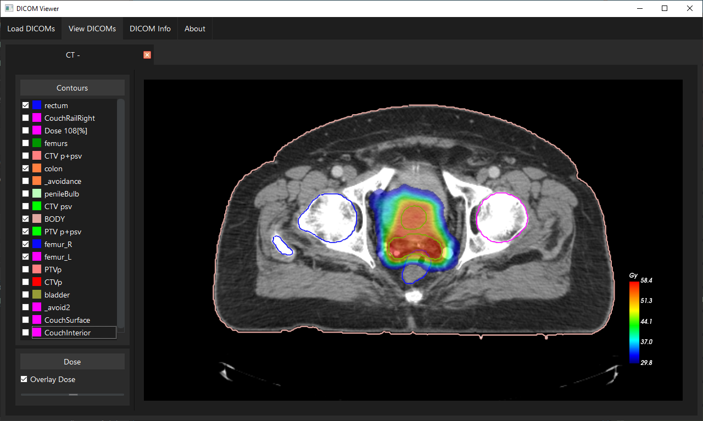
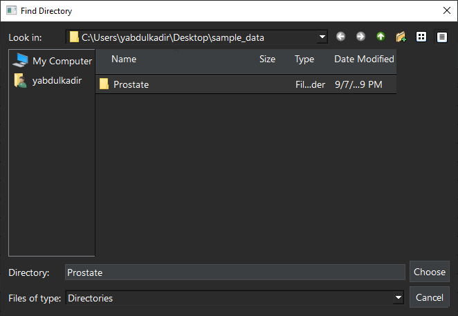
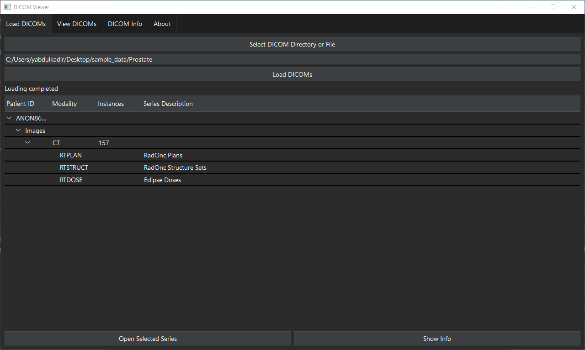
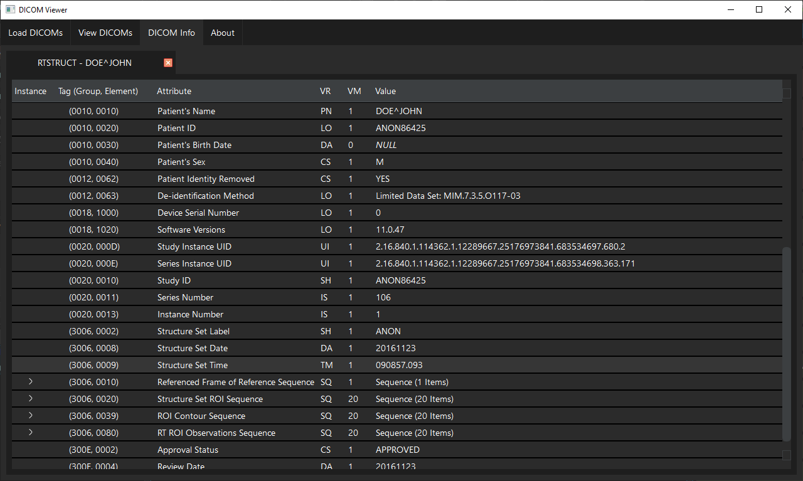

# DICOM Viewer

## Overview

**DICOM Viewer** is a robust, interactive application for visualizing DICOM images, RTSTRUCTS, and RTDOSE data. Designed mainly for researchers, this tool offers an intuitive interface for exploring medical scans, contours, and dose distributions. It integrates PySide6 for the graphical interface and VTK for image rendering.



*Main interface showing DICOM images*

## Features

- **DICOM Image Viewer**: Supports viewing of CT, MRI, PET, and RTDOSE images.
- **RTSTRUCT Overlay**: Visualize radiotherapy contours overlaid on the medical images.
- **RTDOSE Overlay**: Display dose distributions with customizable color mappings.
- **Customizable Window/Level**: Fine-tune the window and level values for better image contrast and clarity.
- **Slice Scrolling**: Easily scroll through different slices of a 3D DICOM dataset using mouse interactions.
- **Dose Thresholding**: Adjust dose thresholds and visualize different ranges of dose data.
- **Tabbed Interface**: Multiple DICOM series can be opened in separate tabs for comparison and review.
- **Dark Theme Support**: Optimized for dark theme UI, ensuring good contrast and readability.

## Installation

1. Clone the repository:

    ```bash
    git clone https://gitlab.com/YAAF/dicomviewer.git
    cd dicomviewer
    ```

2. Install the package:

    ```bash
    pip install .
    ```

3. Run the application:

    ```bash
    dicom-viewer
    ```

## Usage

### Opening DICOM Files




*Opening DICOM files*



*Loading DICOM files from a directory*

- **DICOM Imagee**: Open a DICOM series through the interface to visualize medical images in various modalities (CT, MR, PET).
- **RTSTRUCT**: Load and visualize contours on top of the images by selecting the structure names from the sidebar.
- **RTDOSE**: Display dose heatmaps, with a detailed color legend showing dose intensity.
- Adjust the window and level for contrast control using the left-click drag interaction.
- Use the dose threshold slider to filter dose overlays and focus on specific ranges of interest.


### Showing DICOM Information
The application also alows for viewing the DICOM metadata associated with any DICOM file. From the `Load DICOMs` tab simply select the DICOM object you want to see the metadata for and click on the `Show Info` button. 



*Show the DICOM metadata*

## Technical Details

This project leverages the following technologies:
- **PySide6**: For building the graphical user interface.
- **VTK**: For rendering and interacting with medical images and dose overlays.
- **pydicom**: To handle the reading and interpretation of DICOM files.
- **SimpleITK**: For accurate processing of images, contours and dose data


## Contribution

Contributions are welcome! If you encounter bugs or have feature requests, feel free to open an issue or submit a pull request.

## License

This project is licensed under the LGPL 3.0 License. See the [LICENSE](LICENSE) file for details.

## Contacts
If you have any questions or suggestions, please contact me at YasinAAbdulkadir@gmail.com